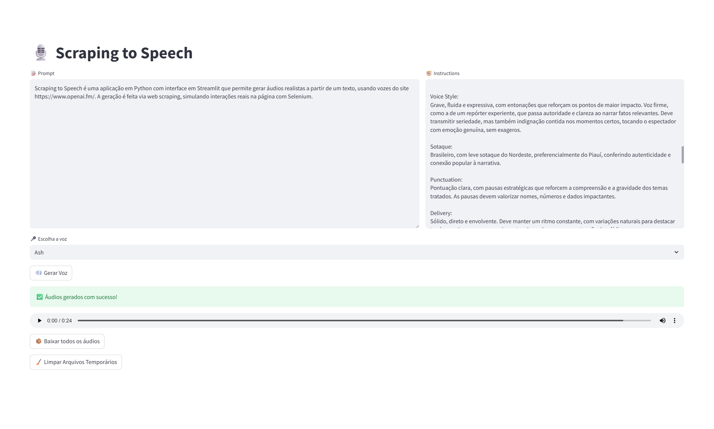

# Scraping to Speech



**Scraping to Speech** é uma aplicação em Python com interface em Streamlit que permite gerar áudios realistas a partir de um texto, usando vozes do site [https://www.openai.fm/](https://www.openai.fm/). A geração é feita via web scraping, simulando interações reais na página com Selenium.

---

## 🌍 Visão Geral

O usuário insere:

* Um **texto longo (prompt)**
* **Instruções de entonação e estilo**
* A **voz desejada** (ex: Ash, Nova, Coral...)

O sistema divide o texto em partes de até 999 caracteres, envia cada uma ao site openai.fm, gera os áudios, baixa automaticamente e permite baixar todos em um .zip.

---

## 🧱 Tecnologias utilizadas

* **Python 3.10+**
* **Streamlit** — para a interface web
* **Selenium + ChromeDriver** — para automação de interações no site
* **BeautifulSoup** (opcional, não essencial neste projeto)
* **zipfile** — para empacotamento dos áudios
* **Pydub** — (caso queira manipular os áudios futuramente)

---

## ⚡ Como rodar o projeto

1. **Clone o repositório:**

```bash
git clone https://github.com/seu-usuario/scraping-to-speech.git
cd scraping-to-speech
```

2. **Crie um ambiente virtual (recomendado):**

```bash
python -m venv env
source env/bin/activate  # Linux/macOS
env\Scripts\activate   # Windows
```

3. **Instale as dependências:**

```bash
pip install -r requirements.txt
```

4. **Execute a aplicação:**

```bash
streamlit run app.py
```

5. Acesse no navegador:

```
http://localhost:8501
```

> Obs: Certifique-se de que o **ChromeDriver** está instalado e compatível com a sua versão do Google Chrome.
> Você pode baixar em: [https://sites.google.com/a/chromium.org/chromedriver/](https://sites.google.com/a/chromium.org/chromedriver/)

---

## 🔍 Exemplo de uso

1. Digite seu texto longo no campo "Prompt"
2. Ajuste as instruções de estilo, entonação e pontuação
3. Escolha uma das 11 vozes disponíveis
4. Clique em **Gerar Voz**
5. Ao final, clique em **Baixar todos os áudios** para obter um .zip com as partes

---

## 🚧 Diretórios ignorados

Certos arquivos e pastas não são versionados:

* `audio_downloads/`: onde os áudios são salvos temporariamente
* `env/`: ambiente virtual
* `*.zip`: pacotes gerados para download

> Veja o arquivo `.gitignore` para a lista completa.

---

## 🌐 Licença

Este projeto é de uso pessoal/demonstrativo e não está afiliado oficialmente à OpenAI ou à plataforma openai.fm.
